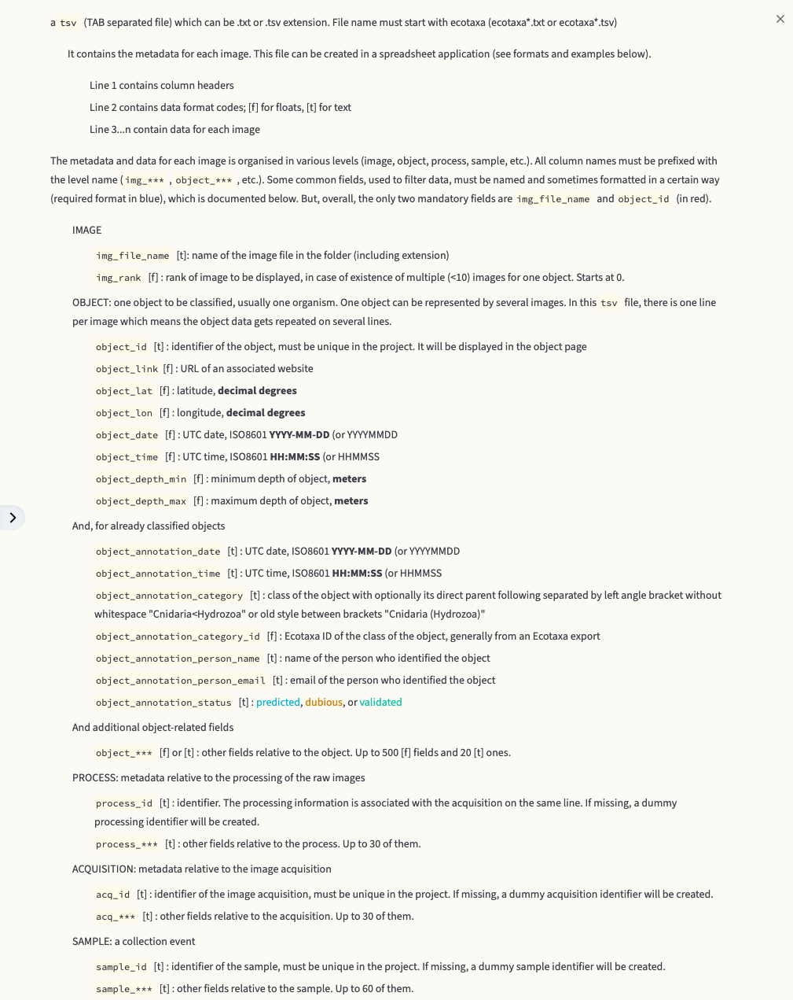

# EcoPart import UVP6 like 

## 1) Minimal content for import
### General folder structure
```
<project_name>/
└── ecodata/
    └── <sample_name>/
        ├── <sample_name>_Particule.zip
        └── <sample_name>_Images.zip  *(optional)*
└── meta/
    └── *header*.txt


```
###  <sample_name>_Particule.zip content
``` shell
<sample_name>_Particule.zip/
    ├── metadata.ini
    └── particules.csv
```
#### metadata.ini content
````
[HW_CONF]
Aa=2300.000
Acquisition_mode=1
Baud_Rate=2
Black_level=0
Calibration_date=20220505
Camera_ref=000125HF
Correction_table_activation=1
Default_acquisition_configuration=ACQ_CTD
Delay_after_power_up_on_time_mode=0
Exp=1.136
Gain=6
IP_adress=193.49.112.100
Image_volume=0.710
Last_parameters_modification=202205091430
Light_ref=000009VE2
Minimum_remaining_memory_for_thumbnail_saving=20000
Operator_email=camille.catalano@imev-mer.fr
Pixel_Size=73
Pressure_offset=0.600
Pressure_sensor_ref=216149
Shutter=75
Storage_capacity=393773
Threshold=22
Time_between_lighting_power_up_and_trigger=0
Time_between_lighting_trigger_and_acquisition=250

[ACQ_CONF]
Acquisition_frequency=25.000
Analog_output_activation=1
Appendices_ratio=1.5
Blocs_per_PT=1
Configuration_name=ACQ_CTD
Embedded_recognition=0
Frames_per_bloc=10
Gain_for_analog_out=5000
Image_nb_for_smoothing=10
Interval_for_measuring_background_noise=10
Limit_lpm_detection_size=10
Maximal_internal_temperature=60
Minimum_object_number=0
Operator_email=camille.catalano@imev-mer.fr
PT_mode=3
Pressure_difference_for_auto_stop=30
Pressure_for_auto_start=10
Result_sending=0
Save_images=2
Save_synthetic_data_for_delayed_request=0
Vignetting_lower_limit_size=620

[sample_metadata]
cruise=TALPRO
ship=RV Belgica II
filename=20220518-034504
profileid=01
bottomdepth=nan
ctdrosettefilename=ctd01
latitude=43°48 08
longitude=009°30 37
firstimage=11209
dn=
winddir=nan
windspeed=nan
seastate=nan
nebuloussness=nan
comment=
endimg=27940
yoyo=
stationid=CTD01
sampletype=P
integrationtime=nan
argoid=
````
What we parse : 
``` shell
          const sample: MetadataIniSampleModel = {
            sample_name: ini_content.sample_metadata['profileid'] as string,
            comment: ini_content.sample_metadata['comment'] as string,
            instrument_serial_number: ini_content.HW_CONF['Camera_ref'] as string,
            optional_structure_id: ini_content.sample_metadata['argoid'] as string,
            station_id: ini_content.sample_metadata['stationid'] as string,
            sampling_date: ini_content.sample_metadata['sampledatetime'] as string,
            wind_direction: ini_content.sample_metadata['winddir'] as number,
            wind_speed: ini_content.sample_metadata['windspeed'] as number,
            sea_state: ini_content.sample_metadata['seastate'] as string,
            nebulousness: ini_content.sample_metadata['nebuloussness'] as number,
            bottom_depth: ini_content.sample_metadata['bottom_depth'] as number,
            instrument_operator_email: ini_content.HW_CONF['Operator_email'] as string,
            filename: ini_content.sample_metadata['filename'] as string,
            filter_first_image: ini_content.sample_metadata['firstimage'] as string,
            filter_last_image: ini_content.sample_metadata['endimg'] as string,
            instrument_settings_acq_gain: ini_content.HW_CONF['Gain'] as number,
            instrument_settings_acq_description: undefined,
            instrument_settings_acq_task_type: undefined,
            instrument_settings_acq_choice: undefined,
            instrument_settings_acq_disk_type: undefined,
            instrument_settings_acq_appendices_ratio: ini_content.ACQ_CONF['Appendices_ratio'] as number,
            instrument_settings_acq_xsize: undefined,
            instrument_settings_acq_ysize: undefined,
            instrument_settings_acq_erase_border: undefined,
            instrument_settings_acq_threshold: ini_content.HW_CONF['Threshold'] as number,
            instrument_settings_process_datetime: undefined,
            instrument_settings_images_post_process: "uvpapp",
            instrument_settings_aa: ini_content.HW_CONF['Aa'] as number,
            instrument_settings_exp: ini_content.HW_CONF['Exp'] as number,
            instrument_settings_image_volume_l: ini_content.HW_CONF['Image_volume'] as number,
            instrument_settings_pixel_size_mm: ini_content.HW_CONF['Pixel_Size'] as number,
            instrument_settings_depth_offset_m: ini_content.HW_CONF['Pressure_offset'] as number,
            instrument_settings_particle_minimum_size_pixels: undefined,
            instrument_settings_vignettes_minimum_size_pixels: undefined,
            instrument_settings_particle_minimum_size_esd: ini_content.ACQ_CONF['Limit_lpm_detection_size'] as number,
            instrument_settings_vignettes_minimum_size_esd: ini_content.ACQ_CONF['Vignetting_lower_limit_size'] as number,
            instrument_settings_acq_shutter_speed: undefined,
            instrument_settings_acq_exposure: undefined,
            instrument_settings_acq_shutter: undefined,

            latitude_raw: ini_content.sample_metadata['latitude'],
            longitude_raw: ini_content.sample_metadata['longitude'],

            sampleType: ini_content.sample_metadata['sampletype']
        }
```
#### particules.csv content

````` shell
HW_CONF,000125HF,1,ACQ_CTD,0,000009VE2,1,0,250,216149,0.600,393773,20000,2,193.49.112.100,0,75,6,22,2300.000,1.136,73,0.710,20220505,202205091430,camille.catalano@imev-mer.fr,40.3,50.8,64,80.6,102,128,161,203,256,323,406,512,645,813,1020,1290,1630,2050;

ACQ_CONF,ACQ_CTD,3,25.000,10,1,10,30,0,0,10,2,620,1.5,10,10,1,5000,0,60,camille.catalano@imev-mer.fr,0,393767;
20220518-042127-284,1.67,31.75,0:1,2005,31.0,9.6;2,65,31.8,8.1;
20220518-042127-468,1.68,31.75,1:1,3079,31.8,10.4;2,424,39.9,17.4;3,120,45.9,21.3;4,80,48.6,23.9;5,44,53.2,28.4;6,23,51.8,29.4;7,19,57.8,33.4;8,7,63.3,41.0;9,9,62.2,35.2;10,2,56.3,23.3;11,4,69.3,40.5;12,1,43.3,20.4;13,1,86.9,41.2;15,2,71.1,35.9;16,1,47.6,25.0;17,2,63.9,36.9;18,2,59.6,30.4;19,2,77.1,33.1;20,2,66.5,35.9;21,1,59.6,39.7;22,1,76.4,41.4;23,1,47.7,20.8;24,1,80.6,40.5;25,2,68.9,30.7;28,1,71.0,31.6;32,1,71.6,42.7;34,1,84.8,40.6;40,1,86.4,41.3;42,1,45.1,22.9;45,1,74.1,41.5;47,1,55.4,26.2;48,1,85.5,39.9;57,2,80.8,43.4;58,1,53.4,26.8;144,1,52.0,41.5;
20220518-042127-507,1.68,31.75,1:1,3052,31.8,10.3;2,386,39.3,17.0;3,151,45.7,23.3;4,87,54.4,27.5;5,31,50.1,25.1;6,29,53.6,27.8;7,15,57.9,31.2;8,10,54.6,27.4;9,11,56.2,31.4;10,6,67.2,37.3;11,2,76.7,39.8;12,1,67.8,46.6;13,3,64.8,38.0;14,1,66.4,28.0;15,2,63.9,40.8;16,3,52.5,26.3;17,6,61.5,33.7;18,1,49.9,26.5;20,1,80.4,35.6;21,3,65.6,41.9;23,1,35.7,12.6;24,1,72.1,29.0;26,2,67.2,34.6;29,1,64.4,28.5;34,1,80.9,34.4;37,1,64.8,29.6;39,1,65.2,32.0;43,1,78.0,36.5;44,1,50.4,23.7;48,1,45.1,22.2;58,1,93.7,47.8;59,1,76.9,31.3;90,1,64.1,48.6;
20220518-042127-547,1.68,31.75,1:1,3045,31.8,10.9;2,422,39.6,16.9;3,143,46.6,21.9;4,83,52.0,26.6;5,29,55.5,29.2;6,33,56.7,31.2;7,11,61.8,32.8;8,7,65.7,38.6;9,9,64.5,33.6;10,6,70.7,36.9;11,4,48.0,21.9;12,8,55.3,30.2;13,1,77.8,25.6;14,1,57.9,22.9;15,1,50.7,29.3;16,2,72.1,38.0;17,1,40.4,15.0;18,1,74.6,44.2;19,3,69.0,35.7;20,1,42.0,14.4;24,2,68.5,38.8;26,2,65.3,35.4;29,1,46.2,23.7;33,2,71.8,33.8;35,2,61.1,32.9;38,2,70.7,42.8;42,1,70.0,42.7;48,1,79.5,39.8;57,1,43.5,19.3;58,1,61.4,32.3;60,1,89.2,46.6;72,1,84.5,48.0;111,1,55.7,40.9;
20220518-042127-587,1.68,31.75,1:1,3074,31.9,10.8;2,416,39.6,17.0;3,151,47.3,23.2;4,88,52.3,28.5;5,36,54.7,31.3;6,27,56.5,28.3;7,18,60.3,36.2;8,10,66.6,42.0;9,6,64.9,33.8;10,8,70.2,35.1;11,4,45.0,21.3;13,1,54.8,25.3;14,2,53.1,27.7;15,1,59.5,25.4;16,2,72.0,33.8;17,3,65.2,31.1;18,3,62.5,32.1;19,3,66.6,42.7;24,1,89.3,44.4;26,1,58.4,23.8;27,2,75.3,34.5;30,1,44.1,24.3;32,1,65.9,31.8;33,2,58.0,33.9;42,1,72.1,38.4;43,1,50.6,22.6;45,1,77.3,35.2;52,1,55.9,20.4;58,1,54.8,21.8;61,1,89.3,33.7;69,1,78.4,41.6;70,1,65.1,35.8;117,1,58.0,44.0;
20220518-042127-632,1.68,31.75,1:1,3092,31.7,10.8;2,406,39.9,19.0;3,149,47.0,22.5;4,78,51.9,27.2;5,45,54.7,29.8;6,21,51.7,26.5;7,18,58.8,30.7;8,10,65.7,34.8;9,4,59.6,27.8;10,1,64.8,21.9;11,3,64.4,29.7;12,2,54.6,26.4;13,3,45.7,22.6;14,3,61.5,39.8;15,1,75.6,36.2;16,2,61.1,29.4;18,2,62.5,31.0;19,1,69.1,35.5;21,2,70.1,36.8;22,2,64.4,39.7;24,1,59.3,30.4;27,1,63.0,37.0;29,2,57.9,31.7;30,2,87.9,43.1;32,1,74.7,30.0;34,1,46.0,20.4;49,1,72.4,39.8;57,1,85.1,46.6;63,1,74.9,33.7;66,2,71.2,40.2;81,1,61.1,43.7;
20220518-042127-695,1.68,31.75,1:1,3067,32.0,10.9;2,388,40.9,18.0;3,138,46.8,23.5;4,81,52.5,26.8;5,41,53.1,27.3;6,15,51.6,27.6;7,13,66.7,37.7;8,8,52.8,26.4;9,6,54.3,28.8;10,9,66.8,32.2;11,3,66.3,37.8;12,1,63.8,32.6;13,2,50.9,22.1;14,3,57.7,28.2;15,2,70.9,40.4;18,1,92.4,55.2;21,1,79.7,40.5;22,3,46.9,29.6;23,1,76.1,44.7;24,1,70.1,25.9;25,5,54.5,27.5;26,1,65.4,36.4;29,1,57.4,31.1;38,1,44.5,17.4;42,1,44.0,23.5;46,1,75.6,36.0;54,1,74.6,37.4;61,1,47.6,21.6;62,1,69.1,36.5;67,1,88.9,40.6;136,1,51.2,41.1;
20220518-042127-742,1.68,31.75,1:1,3095,31.9,10.6;2,432,39.3,17.1;3,142,46.6,22.3;4,77,52.6,27.8;5,44,57.7,28.9;6,21,58.6,32.1;7,15,56.1,34.5;8,7,51.4,24.5;9,4,66.9,38.5;10,3,58.8,29.9;11,2,68.6,35.7;13,3,60.1,27.4;14,2,63.1,30.5;15,1,47.3,25.2;16,2,55.6,27.3;17,4,61.6,36.8;21,2,63.2,36.8;24,3,60.3,28.9;27,1,61.4,34.0;28,1,92.9,52.0;29,3,60.0,34.4;33,1,83.0,41.2;34,1,43.6,18.0;36,1,66.0,29.2;42,1,46.0,21.3;43,1,64.6,42.9;45,1,49.9,26.2;62,1,88.1,41.5;70,1,70.6,40.3;71,1,77.8,45.4;131,1,56.2,45.5;
20220518-042127-781,1.68,31.75,1:1,3049,32.1,11.2;2,420,40.8,18.5;3,141,47.7,22.8;4,86,53.1,28.3;5,40,55.8,29.5;6,25,56.7,31.5;7,12,50.5,26.6;8,11,60.8,33.3;9,6,62.8,35.9;10,7,69.4,40.6;11,3,63.1,37.0;12,4,60.7,27.8;13,2,68.7,34.3;14,1,72.9,45.1;16,2,54.0,34.2;17,1,80.8,36.9;18,1,57.3,31.1;20,2,69.8,38.8;22,1,39.6,19.8;24,2,67.6,34.1;26,1,63.1,32.0;27,2,55.9,24.5;28,3,52.2,26.2;29,2,48.7,23.6;39,1,72.2,41.1;40,1,46.7,22.1;42,1,62.1,28.3;44,1,76.6,42.9;56,1,66.5,31.1;58,1,43.1,16.9;66,1,73.9,37.6;153,1,54.6,35.2;
20220518-042127-821,1.68,31.75,1:1,3142,32.4,11.3;2,410,39.5,17.0;3,145,48.1,23.1;4,83,51.6,27.8;5,27,57.5,32.6;6,27,54.4,27.6;7,9,61.0,34.1;8,8,56.0,27.8;9,7,59.9,36.8;10,4,50.8,28.4;11,2,60.0,40.0;12,6,58.4,29.4;13,2,63.2,25.9;14,5,55.5,31.8;15,1,39.5,14.0;16,1,31.4,8.8;17,1,84.9,43.3;18,1,67.1,27.4;19,3,57.4,28.8;21,3,69.5,40.5;23,2,55.7,26.3;25,4,61.9,32.8;26,1,51.5,24.5;30,1,54.5,25.4;31,1,45.8,21.1;36,1,50.8,22.7;38,1,76.7,36.7;39,1,72.8,40.4;66,1,70.6,37.9;110,1,58.1,43.9;
20220518-042127-861,1.68,31.75,1:1,3069,31.8,10.7;2,426,40.3,17.8;3,131,46.6,22.9;4,83,51.7,25.0;5,40,53.3,29.0;6,26,55.0,31.2;7,9,61.3,31.5;8,7,61.1,33.0;9,4,54.8,31.7;10,12,53.7,30.0;11,1,78.6,30.3;12,4,54.5,29.3;13,3,51.4,25.7;14,2,63.5,35.7;15,1,68.1,30.0;16,2,57.7,31.0;17,3,74.0,38.3;18,1,40.8,13.8;19,3,70.3,29.9;20,2,60.7,37.7;21,1,70.7,41.6;22,2,47.1,23.0;24,1,66.3,26.6;25,1,60.4,26.2;27,1,44.5,16.1;29,1,55.8,31.8;30,2,56.2,32.5;35,1,47.8,20.1;38,2,59.5,34.1;42,1,87.8,42.2;65,1,72.0,38.9;78,1,80.9,44.7;164,1,51.4,40.7;
20220518-042128-055,1.7,31.75,1:1,3066,31.7,10.6;2,419,39.1,17.0;3,135,46.7,23.3;4,88,51.8,25.9;5,39,56.4,30.4;6,18,54.1,27.5;7,12,69.7,42.5;8,15,62.6,36.4;9,8,63.9,41.8;10,8,54.2,25.3;11,1,74.2,36.2;12,1,47.7,17.7;14,2,68.7,36.8;15,4,67.0,36.4;16,3,64.0,39.9;17,5,55.6,35.0;18,1,39.2,16.7;19,1,64.5,29.8;20,2,45.3,19.4;21,4,67.6,33.8;23,2,64.2,37.8;24,2,57.1,33.3;26,1,46.2,22.2;29,1,62.3,28.7;32,1,75.4,38.2;35,1,70.0,31.2;37,1,48.5,23.2;40,1,62.6,33.4;42,3,67.7,39.6;48,1,73.2,41.1;53,1,71.7,32.1;65,1,67.5,38.9;100,1,65.9,44.8;
20220518-042128-094,1.7,31.75,1:1,3138,31.7,10.6;2,405,38.5,16.5;3,135,48.8,25.5;4,98,52.4,26.4;5,48,55.3,28.6;6,20,58.6,34.8;7,10,58.5,32.3;8,6,60.1,32.4;9,7,48.8,23.7;10,4,65.7,36.2;11,4,49.0,23.3;12,4,65.1,37.5;13,5,59.3,28.0;14,3,61.7,30.4;17,2,63.7,31.1;18,2,60.6,37.1;19,3,60.0,31.9;22,1,68.0,40.6;23,2,79.5,40.0;24,3,63.1,35.8;25,1,50.5,24.1;26,1,48.8,16.9;27,2,53.6,25.5;28,1,54.6,24.0;29,1,50.7,24.1;33,1,74.4,38.2;34,2,81.8,43.9;35,1,75.3,41.6;39,1,49.3,23.7;43,2,67.3,40.0;57,1,66.8,38.6;60,1,77.2,46.3;62,1,67.7,35.6;
20220518-042128-134,1.7,31.75,1:1,3122,32.2,10.8;2,388,40.2,18.0;3,148,45.3,22.8;4,79,53.1,26.1;5,40,54.1,29.1;6,18,60.2,34.3;7,19,62.5,32.2;8,6,64.5,37.4;9,6,70.1,39.6;10,9,56.3,28.3;11,4,64.9,37.6;12,2,60.0,31.3;13,2,70.7,37.0;14,4,59.8,32.9;15,4,62.3,35.6;16,7,58.8,30.5;17,1,63.8,33.0;18,2,68.6,38.7;20,3,61.9,35.9;21,1,59.8,28.2;22,2,57.6,34.7;23,2,55.4,21.1;24,1,64.6,32.9;25,1,68.8,36.4;28,2,56.1,21.9;29,1,82.7,45.2;30,1,75.8,36.3;33,1,62.9,30.2;40,1,71.5,39.8;43,1,61.9,34.5;46,1,61.1,28.2;59,1,71.4,34.7;69,1,72.9,36.9;
20220518-042128-173,1.7,31.75,1:1,3121,32.3,11.3;2,413,39.9,18.0;3,153,44.8,21.9;4,75,51.4,28.0;5,47,57.2,32.0;6,25,56.0,29.6;7,13,61.2,38.7;8,5,71.0,35.6;9,6,62.9,35.1;10,6,58.7,34.6;11,6,68.7,33.1;12,7,53.2,26.3;14,3,64.8,33.9;15,2,69.4,33.7;16,2,70.3,35.8;17,4,63.6,33.3;18,1,47.2,19.2;21,3,56.4,28.7;22,2,61.3,29.9;23,2,79.2,46.4;26,2,65.8,34.8;27,1,55.5,23.7;28,1,54.8,24.2;30,1,75.9,39.5;33,1,53.2,25.6;38,1,74.7,40.1;41,1,63.2,26.0;46,1,71.4,40.1;47,1,60.7,32.8;49,1,69.0,36.3;50,1,89.4,44.5;53,1,69.2,40.4;
20220518-042128-224,1.7,31.75,1:1,3046,32.0,11.2;2,383,39.5,16.5;3,141,45.9,22.0;4,81,52.2,27.8;5,49,51.6,27.8;6,18,62.8,31.3;7,10,54.0,31.4;8,10,65.1,38.7;9,9,57.2,30.0;10,7,62.9,33.9;11,7,53.1,25.5;12,3,53.6,25.3;13,4,56.9,35.9;15,3,66.3,35.9;16,2,53.3,27.3;18,2,71.3,34.2;19,2,63.4,38.0;20,2,68.9,36.4;23,3,60.2,31.2;24,1,83.1,39.0;25,1,57.6,28.6;26,1,46.8,22.6;28,2,60.9,33.5;30,1,52.2,27.7;31,1,48.7,25.7;33,1,69.2,37.5;36,2,68.5,33.7;38,1,36.1,9.8;40,1,61.8,30.6;41,1,51.9,23.9;47,1,74.0,42.0;57,1,74.8,40.0;
20220518-042128-304,1.7,31.75,1:1,3085,32.2,10.7;2,413,38.3,16.5;3,140,47.0,23.0;4,66,52.2,25.1;5,41,55.6,31.0;6,22,53.0,28.7;7,9,55.4,26.8;8,9,62.2,31.9;9,8,61.3,32.6;10,5,59.5,37.6;11,6,61.0,32.5;12,4,71.6,37.5;13,4,60.6,30.7;14,2,56.2,29.2;15,7,63.8,35.0;16,1,78.2,43.6;17,1,66.1,40.0;18,1,91.9,42.9;19,2,60.9,39.3;20,2,59.8,30.0;21,1,59.1,27.2;22,2,54.6,25.0;24,2,53.4,29.6;30,1,67.1,31.4;31,2,59.5,32.0;32,1,70.7,37.5;34,1,79.4,44.3;35,1,61.9,30.9;38,1,69.6,39.7;41,2,62.3,32.8;43,1,63.8,35.9;47,2,63.7,33.3;52,1,57.2,25.0;189,1,86.0,44.2;
20220518-042128-352,1.7,31.75,1:1,2964,32.3,11.5;2,416,38.8,17.2;3,130,46.6,23.5;4,71,51.1,25.0;5,46,54.0,28.3;6,26,54.0,28.0;7,18,61.4,33.1;8,10,62.6,34.3;9,7,60.5,30.9;10,3,57.9,35.2;11,6,59.9,29.3;12,2,39.4,23.9;14,3,64.5,33.5;15,1,69.5,38.9;16,2,52.9,26.3;18,2,54.3,28.3;20,2,60.1,25.2;21,3,77.7,45.0;22,2,59.0,27.2;23,1,59.8,33.7;25,2,63.1,34.0;26,1,73.9,41.6;28,1,48.0,16.6;29,1,62.2,31.2;31,1,60.0,28.9;33,1,52.8,24.1;34,1,61.9,33.6;36,1,70.2,34.0;44,3,57.7,29.3;45,1,68.5,35.0;48,1,68.6,37.1;61,1,69.6,38.8;64,1,82.8,44.3;
20220518-042128-391,1.7,31.75,1:1,3084,32.1,10.8;2,412,41.6,19.2;3,144,47.3,22.7;4,70,48.3,22.8;5,37,57.4,30.2;6,28,58.6,30.7;7,12,62.0,30.9;8,13,60.7,31.9;9,9,64.0,36.8;10,4,59.3,34.4;11,6,54.2,28.4;12,6,52.3,28.4;13,4,57.6,25.6;14,2,58.5,30.5;15,3,80.7,48.4;16,3,66.0,34.7;17,1,51.2,22.5;18,1,58.6,34.9;19,2,59.3,33.2;20,1,66.2,29.7;21,1,74.3,35.2;22,1,53.7,28.9;23,2,42.6,18.5;26,1,63.4,36.7;27,2,50.8,30.2;29,1,61.7,36.0;30,1,52.8,21.2;31,2,59.5,34.4;33,1,46.5,16.4;38,2,68.0,35.3;39,1,72.6,38.8;42,2,74.6,36.2;54,1,71.8,42.0;59,1,54.4,25.6;
20220518-042128-431,1.7,31.75,1:1,3173,31.7,10.4;2,406,40.1,18.2;3,142,46.2,22.1;4,86,52.6,26.6;5,40,56.5,26.8;6,18,59.4,31.0;7,9,60.1,34.3;8,14,58.9,31.8;9,3,49.1,25.2;10,2,52.5,31.2;11,1,41.8,25.2;12,5,66.0,34.7;13,1,39.6,13.0;14,3,66.6,38.0;15,1,43.4,22.2;16,3,66.8,32.3;17,2,53.6,33.5;18,1,77.8,39.4;19,3,64.8,34.8;20,2,47.3,18.6;21,1,46.3,16.6;22,3,63.9,32.8;23,2,72.5,31.5;24,2,62.7,26.6;25,2,45.4,19.2;26,1,72.3,29.1;29,2,55.6,30.8;30,1,72.7,39.5;34,1,63.9,39.3;36,1,51.7,26.5;37,1,47.6,20.1;38,1,72.7,31.8;41,2,67.3,33.2;43,1,73.9,37.0;46,1,69.4,42.1;48,1,55.7,25.2;
20220518-042128-471,1.7,31.75,1:1,3090,31.9,10.5;2,394,39.3,17.4;3,120,43.0,20.3;4,73,54.0,28.4;5,39,58.2,29.5;6,24,57.2,32.6;7,17,63.2,32.4;8,6,53.2,26.7;9,3,67.0,42.2;10,7,51.3,31.1;11,6,52.3,32.2;12,3,49.9,25.4;13,1,51.2,21.4;14,2,48.9,18.5;15,5,64.1,31.1;16,2,70.8,41.9;17,1,88.5,39.9;18,1,50.8,25.0;19,2,64.8,32.7;20,3,67.8,41.3;21,1,61.6,31.7;23,2,63.2,31.7;25,2,53.2,26.7;27,3,69.5,37.0;28,1,69.6,33.4;29,1,53.4,29.7;31,1,94.9,39.3;32,1,49.4,29.6;33,1,60.7,35.4;36,1,54.1,25.5;39,1,97.4,51.3;40,3,69.4,41.1;41,1,74.8,40.1;43,1,59.2,27.2;52,1,69.1,38.2;57,1,53.9,26.1;
[...]
`````

We extract max pressure at import time. and store this file as it is.

### meta/\*header*.txt content
File content : header then on data line by sample (profileid)
``` 
cruise;ship;filename;profileid;bottomdepth;ctdrosettefilename;latitude;longitude;firstimage;volimage;aa;exp;dn;winddir;windspeed;seastate;nebuloussness;comment;endimg;yoyo;stationid;sampletype;integrationtime;argoid;pixelsize;sampledatetime;constantdepth
TALPRO;RV Belgica II;20220518-034504;01;nan;ctd01;43�48 08;009�30 37;11209;0.710;0.0023;1.136;;nan;nan;nan;nan;;27940;;CTD01;P;nan;;73;20220518-042127-284;
TALPRO;RV Belgica II;20220518-121535;02;nan;ctd03;43�03 05;009�42 25;3360;0.710;0.0023;1.136;;nan;nan;nan;nan;;20140;;CTD03;P;nan;;73;20220518-122516-242;

```

What we extract : 
``` js
 const sample: HeaderSampleModel = {
            cruise: fields[0],
            ship: fields[1],
            filename: fields[2],
            profileId: fields[3],
            bottomDepth: parseFloat(fields[4]),
            ctdRosetteFilename: fields[5],
            latitude: fields[6],
            longitude: fields[7],
            firstImage: parseFloat(fields[8]),
            volImage: parseFloat(fields[9]),
            aa: parseFloat(fields[10]),
            exp: parseFloat(fields[11]),
            dn: parseFloat(fields[12]),
            windDir: parseFloat(fields[13]),
            windSpeed: parseFloat(fields[14]),
            seaState: fields[15],
            nebulousness: parseFloat(fields[16]),
            comment: fields[17],
            endImg: parseFloat(fields[18]),
            yoyo: fields[19],
            stationId: fields[20],
            sampleType: fields[21],
            integrationTime: parseFloat(fields[22]),
            argoId: fields[23],
            pixelSize: parseFloat(fields[24]),
            sampleDateTime: fields[25],
            constantdepth: parseFloat(fields[26])
        };
```

###  <sample_name>_Images.zip content *(optional)*
```
<sample_name>_Particule.zip/
    ├── <sample_name>/
        ├── <image_1>.png
        └── <image_n>.png
    ├── compute_vignette.txt
    └── ecotaxa_<sample_name>.tsv
```
#### compute_vignette.txt content

``` shell
[vignette]
; gamma coefficiant of the gamma correction
gamma=1
; invert image (black => white) : Values Y/N case insensitive
invert=y
; size in millimeter of the scale bar
scalebarsize_mm=2.0
; load original image in Ecotaxa in adition of the computer vignette : Values Y/N case insensitive
keeporiginal=y
; color of the text in the footer (black or white), if white then background is black, else background is 254
fontcolor=black
; height of the text in the footer in pixel
fontheight_px=6
; height of the footer in pixel
footerheight_px=31
; scale factor to resize the image, 1 = No change , >1 increase size using bucubic method
scale=1
; pixel_size in micrometer will be added during sample generation, used to compute scalebar width

```

#### ecotaxa_<sample_name>.tsv content
Classic ecotaxa tsv file cf EcoTaxa documentation :




## 2) Minimal content for import L0b backup

For import backup we save all the 'raw', 'meta', 'config' folders.

```
<project_name>/
└── meta/
    └── *
└── raw/
    └── */
└── config/
    └── *

```

**meta** : copy all the meta folder
**config** :  copy all the config folder
**raw** :  zip and save all sub folder of raw folder
